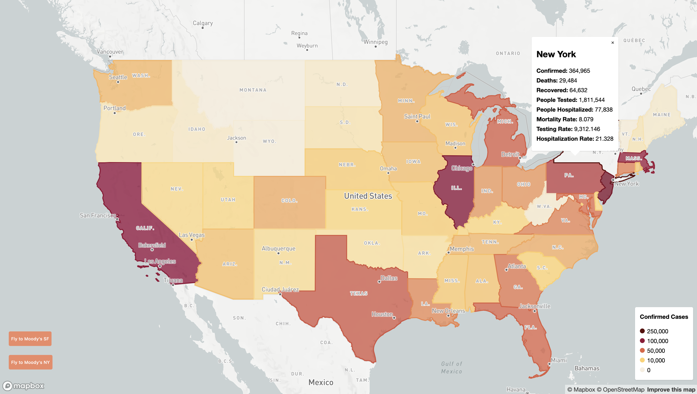

# Mapping the COVID-19 Crisis with Mapbox

I led a workshop for my company to help my coworkers become familiar with developing informative and interactive maps with the Mapbox API.

In this workshop, I gave an overview on the power of Mapbox and walked my coworkers through layering and styling county and state level data regarding COVID-19 cases.



Below you can find the steps to create this map for yourself.

## COVID-19 Data

The data used for this project was provided by [Johns Hopkins University](https://github.com/CSSEGISandData/COVID-19).

I created and ran a Python script that used GeoPandas to convert these raw CSV files into GeoJSON files for use in Mapbox.

## 1. Start the server

Start a simple server in the shell inside the directory your files are located so we can fetch files with the support of CORS.

```bash
cd covid-mapbox-workshop

# try this
python -m SimpleHTTPServer 8080

# if the above doesn't work, try this
python -m http.server 8080
```

Open up Chrome and navigate to [`localhost:8080`](http://localhost:8080) (or `127.0.0.1:8080` if that does not work). You should see a blank map.

## 2. Starter template

**You can skip to step 5 to see the completed example.** Step 2 just explains what's provided in the `index.html` file.

Higher zoom levels (i.e., 22-24) = more zoomed into the map (individual street and building view)

**Initialize map and set some attributes.**

```jsx
var map = new mapboxgl.Map({
	container: "map", // HTML element to render the map
  style: "mapbox://styles/mapbox/light-v10", // predefined Mapbox style or custom style
  center: [-98, 38.88], // initial center point of map
  minZoom: 3, // minimum zoom level of map
  zoom: 3, // initial zoom level of map
});
```

**On successful loading of the map, add state and county data sources to map's style.**

**Note:** this does not actually display the data layers, we will configure that in the next step.

```jsx
// zoom level that determines the displaying of county or state data
var zoomThreshold = 5;

// "load" event listener to add data
map.on("load", function () {
	map.addSource("county", {
	  type: "vector",
    url: "mapbox://arshijujara.74c3l922",
	});

  map.addSource("state", {
	  type: "vector",
    url: "mapbox://arshijujara.7pz4ikss",
	});

  var stateLegendEl = document.getElementById("state-legend");
  var countyLegendEl = document.getElementById("county-legend");

	// "zoom" event listener to toggle changes based on zoom level
  map.on("zoom", function () {
	  if (map.getZoom() > zoomThreshold) {
	    stateLegendEl.style.display = "none";
      countyLegendEl.style.display = "block";
    } else {
	    stateLegendEl.style.display = "block";
	    countyLegendEl.style.display = "none";
    }
	});
});
```

## 3. Add state and county fill layers

Here we'll actually define how data from our sources will be styled.

```jsx
map.on("load", function() {
	// ... addSource layers

	map.addLayer(
	  {
	    id: "state",
	    source: "state",
	    "source-layer": "statecoviddata",
	    maxzoom: zoomThreshold, // display layer at zoom layers < zoomThreshold
	    type: "fill",
	    paint: {
	      "fill-color": [
	        "interpolate", // expression
	        ["linear"], // interpolation type - can be linear, exponential, cubic-bezier
	        ["get", "Confirmed"], // input - number, "get" is another expression
	        0, "#f6eedf", // stop input (number) followed by stop output (color)
	        10000, "#ffd369",
	        50000, "#e26241",
	        100000, "#940a37",
	        250000, "#5b0909",
	      ],
	      "fill-opacity": 1
	    },
	  },
	  "waterway-label" // beforeId - put this layer before 'waterway-label'
	);

	map.addLayer(
	  {
	    id: "county",
	    source: "county",
	    "source-layer": "countycoviddata",
	    minzoom: zoomThreshold, // display layer at zoom layers > zoomThreshold
	    type: "fill",
	    paint: {
	      "fill-color": [
	        "interpolate",
	        ["linear"],
	        ["get", "Confirmed"],
	        0, "#f6eedf",
	        100, "#ffd369",
	        1000, "#e26241",
	        10000, "#940a37",
	        50000, "#5b0909",
	      ],
	      "fill-opacity": 1
	    },
	  },
	  "waterway-label"
	);

});
```

## 4. Add state and county line layers

Adds an outline layer to the state and county polygons.

```jsx
map.on("load", function() {
	// ... addSource
	// ... addLayer(s)

	map.addLayer(
	  {
	    id: "state-line",
	    source: "state",
	    "source-layer": "statecoviddata",
	    maxzoom: zoomThreshold,
	    type: "line",
	    paint: {
	      "line-color": [
	        "interpolate",
	        ["linear"],
	        ["get", "Confirmed"],
	        0, "#f6eedf",
	        10000, "#ffd369",
	        50000, "#e26241",
	        100000, "#940a37",
	        250000, "#5b0909",
	      ],
	      "line-width": 2,
	    },
	  },
	  "waterway-label"
	);

	map.addLayer(
	  {
	    id: "county-line",
	    source: "county",
	    "source-layer": "countycoviddata",
	    minzoom: zoomThreshold,
	    type: "line",
	    paint: {
	      "line-color": [
	        "interpolate",
	        ["linear"],
	        ["get", "Confirmed"],
	        0, "#f6eedf",
	        100, "#ffd369",
	        1000, "#e26241",
	        10000, "#940a37",
	        50000, "#5b0909",
	      ],
	      "line-width": 1,
	    },
	  },
	  "waterway-label"
	);

});
```

## 5. Finished Product

All the code snippets put together for your convenience. Just replace all the code in the starter template with the following. You should be able to see the county and state layers on the map.

Alternatively, check the `final.html` file for the full code.

```jsx
<!DOCTYPE html>
<html>

<head>
  <meta charset="utf-8" />
  <title>Mapping the COVID-19 Crisis with Mapbox</title>
  <meta name="viewport" content="initial-scale=1,maximum-scale=1,user-scalable=no" />
  <script src="https://api.mapbox.com/mapbox-gl-js/v1.10.0/mapbox-gl.js"></script>
  <link href="https://api.mapbox.com/mapbox-gl-js/v1.10.0/mapbox-gl.css" rel="stylesheet" />
  <style>
    body {
      margin: 0;
      padding: 0;
    }

    #map {
      position: absolute;
      top: 0;
      bottom: 0;
      width: 100%;
    }

    .legend {
      background-color: #fff;
      border-radius: 3px;
      bottom: 30px;
      box-shadow: 0 1px 2px rgba(0, 0, 0, 0.1);
      font: 12px/20px "Helvetica Neue", Arial, Helvetica, sans-serif;
      padding: 10px;
      position: absolute;
      right: 10px;
      z-index: 1;
    }

    .legend h4 {
      margin: 0 0 10px;
    }

    .legend div span {
      border-radius: 50%;
      display: inline-block;
      height: 10px;
      margin-right: 5px;
      width: 10px;
    }
  </style>
</head>

<body>
  <div id="map"></div>

  <div id="state-legend" class="legend">
    <h4>Confirmed Cases</h4>
    <div><span style="background-color: #5b0909;"></span>250,000</div>
    <div><span style="background-color: #940a37;"></span>100,000</div>
    <div><span style="background-color: #e26241;"></span>50,000</div>
    <div><span style="background-color: #ffd369;"></span>10,000</div>
    <div><span style="background-color: #f6eedf;"></span>0</div>
  </div>

  <div id="county-legend" class="legend" style="display: none;">
    <h4>Confirmed Cases</h4>
    <div><span style="background-color: #5b0909;"></span>50,000</div>
    <div><span style="background-color: #940a37;"></span>10,000</div>
    <div><span style="background-color: #e26241;"></span>1,000</div>
    <div><span style="background-color: #ffd369;"></span>100</div>
    <div><span style="background-color: #f6eedf;"></span>0</div>
  </div>

  <script>
    mapboxgl.accessToken =
      "pk.eyJ1IjoiYXJzaGlqdWphcmEiLCJhIjoiY2s3djZ0eXU0MDVoNDNmcWw0bjdwem80eCJ9.FVZGBovV50lCO1YeeNL87Q";
    var map = new mapboxgl.Map({
      container: "map",
      style: "mapbox://styles/mapbox/light-v10", // https://docs.mapbox.com/mapbox-gl-js/example/setstyle/
      center: [-98, 38.88],
      minZoom: 3,
      zoom: 3,
    });

    var zoomThreshold = 4;

    map.on("load", function() {
      // data is updated as of May 27, 2020
      map.addSource("county", {
        type: "vector",
        url: "mapbox://arshijujara.74c3l922",
      });

      map.addSource("state", {
        type: "vector",
        url: "mapbox://arshijujara.7pz4ikss",
      });

      map.addLayer({
          id: "state",
          source: "state",
          "source-layer": "statecoviddata",
          maxzoom: zoomThreshold,
          type: "fill",
          paint: {
            "fill-color": [
              "interpolate",
              ["linear"],
              ["get", "Confirmed"],
              0, "#f6eedf",
              10000, "#ffd369",
              50000, "#e26241",
              100000, "#940a37",
              250000, "#5b0909",
            ],
            "fill-opacity": 1
          },
        },
        "waterway-label"
      );

      map.addLayer({
          id: "county",
          source: "county",
          "source-layer": "countycoviddata",
          minzoom: zoomThreshold,
          type: "fill",
          paint: {
            "fill-color": [
              "interpolate",
              ["linear"],
              ["get", "Confirmed"],
              0, "#f6eedf",
              100, "#ffd369",
              1000, "#e26241",
              10000, "#940a37",
              50000, "#5b0909",
            ],
            "fill-opacity": 1
          },
        },
        "waterway-label"
      );

      map.addLayer({
          id: "state-line",
          source: "state",
          "source-layer": "statecoviddata",
          maxzoom: zoomThreshold,
          type: "line",
          paint: {
            "line-color": [
              "interpolate",
              ["linear"],
              ["get", "Confirmed"],
              0, "#f6eedf",
              10000, "#ffd369",
              50000, "#e26241",
              100000, "#940a37",
              250000, "#5b0909",
            ],
            "line-width": 2,
          },
        },
        "waterway-label"
      );

      map.addLayer({
          id: "county-line",
          source: "county",
          "source-layer": "countycoviddata",
          minzoom: zoomThreshold,
          type: "line",
          paint: {
            "line-color": [
              "interpolate",
              ["linear"],
              ["get", "Confirmed"],
              0, "#f6eedf",
              100, "#ffd369",
              1000, "#e26241",
              10000, "#940a37",
              50000, "#5b0909",
            ],
            "line-width": 1,
          },
        },
        "waterway-label"
      );

      var stateLegendEl = document.getElementById("state-legend");
      var countyLegendEl = document.getElementById("county-legend");

      map.on("zoom", function() {
        if (map.getZoom() > zoomThreshold) {
          stateLegendEl.style.display = "none";
          countyLegendEl.style.display = "block";
        } else {
          stateLegendEl.style.display = "block";
          countyLegendEl.style.display = "none";
        }
      });
    });
  </script>
</body>

</html>
```

## Links to Documentation

- COVID-19 Data Github Repo: [https://github.com/CSSEGISandData/COVID-19](https://github.com/CSSEGISandData/COVID-19)
- Mapbox Examples: [https://docs.mapbox.com/mapbox-gl-js/examples/](https://docs.mapbox.com/mapbox-gl-js/examples/)
- Hover effect: [https://docs.mapbox.com/mapbox-gl-js/example/hover-styles/](https://docs.mapbox.com/mapbox-gl-js/example/hover-styles/)
- Popup: [https://docs.mapbox.com/mapbox-gl-js/example/popup-on-click/](https://docs.mapbox.com/mapbox-gl-js/example/popup-on-click/)
- Fly to: [https://docs.mapbox.com/mapbox-gl-js/example/flyto/](https://docs.mapbox.com/mapbox-gl-js/example/flyto/)
